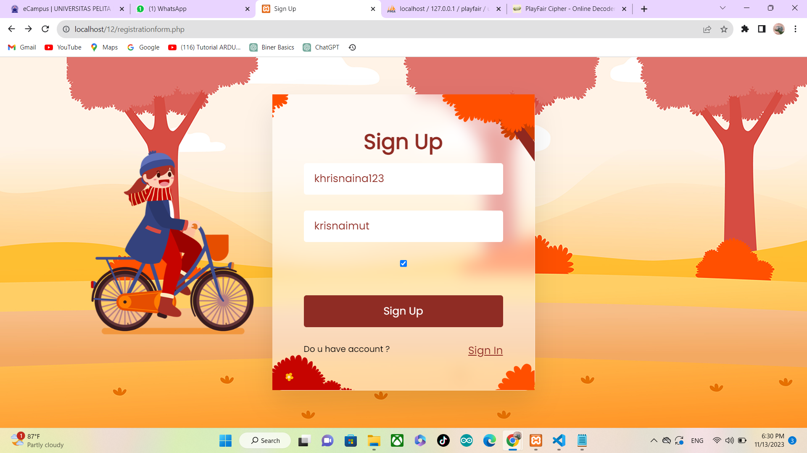
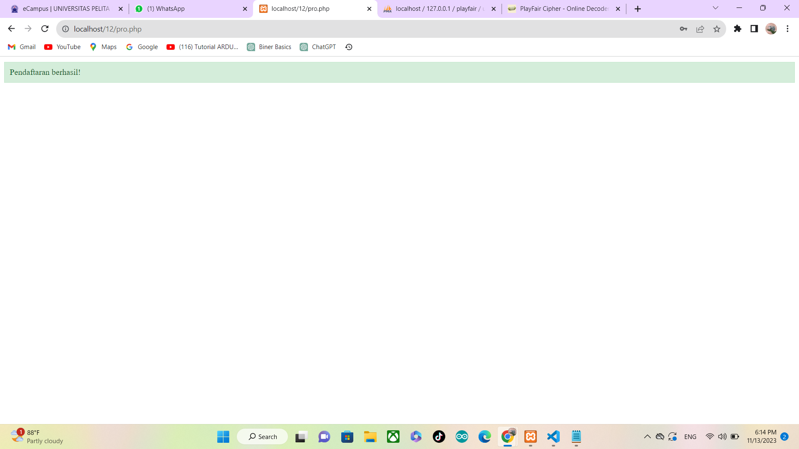
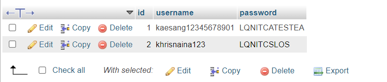
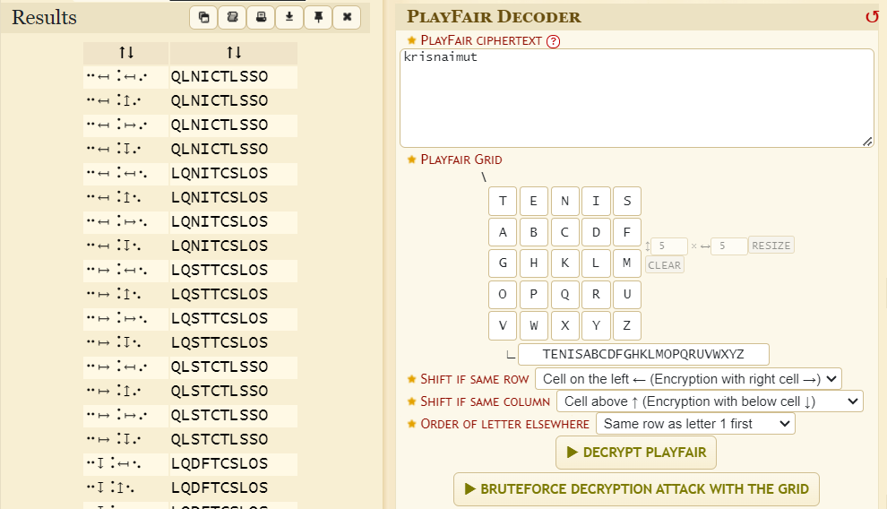
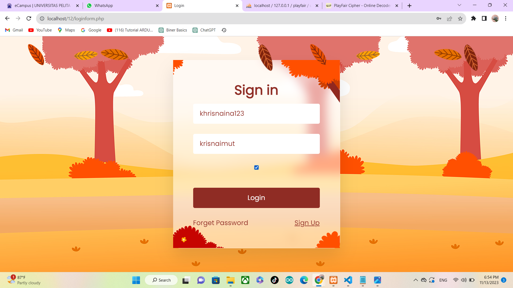
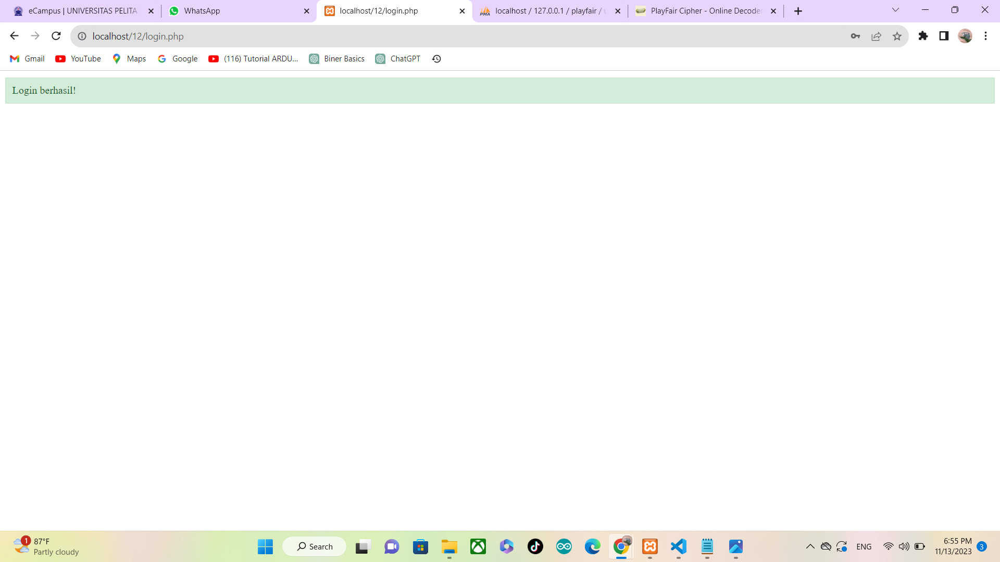

# uts_playfaircipher </br>
**_Nama: Muhammad Khrisna_** </br>
**_Kelas: TI.21.A2_** </br>
**_Nim: 312110177_** </br>
<br/><br/>

## **Tampilan Sign Up**

<br/>

## **Tampilan ketika sign up berhasil** 


<br/>

## **Database**


<br/>

## **memvalidasi apakah fungsi playfair cipher sukses di terapkan di dalam password atau tidak**


<br/>

## **Tampilan Sign in**


<br/>

## **Tampilan ketika sign in berhasil**


<br/>


## **Directory Tree**
```bash
potofolio_revou
│   
├──registrationform.php
├──pro.php
│ 
│ 
├──loginform.php
├──login.php
│        
└───login.css
```
